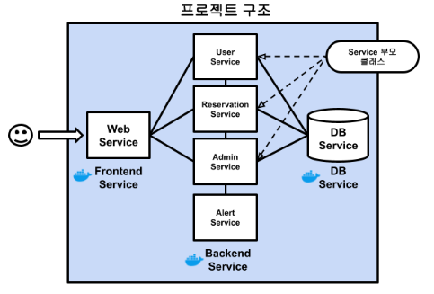
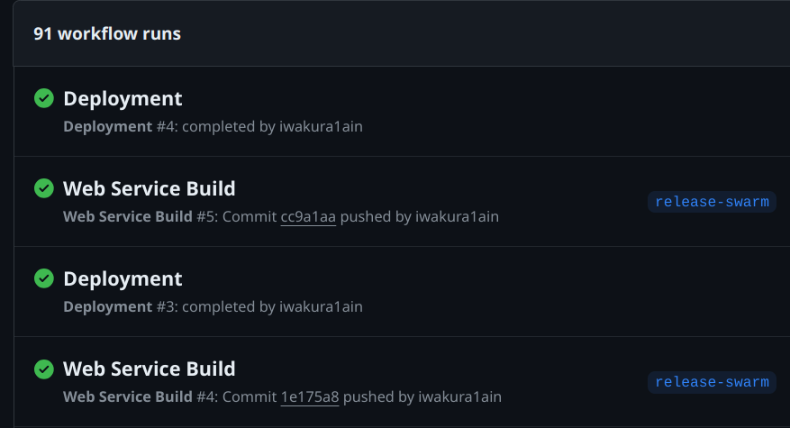
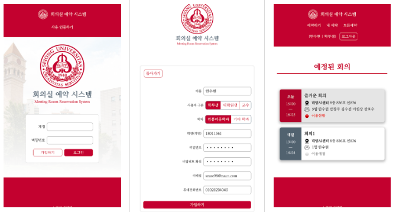
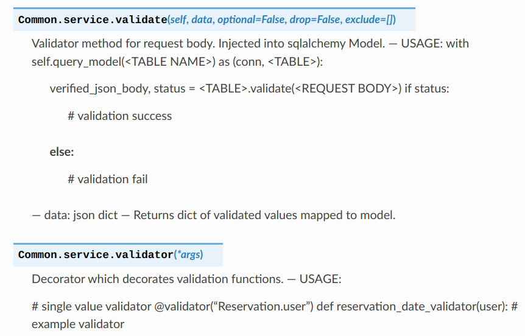

#+OPTIONS: toc:nil
#+OPTIONS: org-export-with-smart-quotes
#+OPTIONS: org-export-with-emphasize
#+OPTIONS: org-export-with-timestamps
#+BEGIN_EXPORT html
---
title: Sejong Reservation
layout: project
type: web
image: sejong-reservation.png
short: <b>&nbsp;학교 내 회의실 예약을 위한 웹서비스</b> 
desc: |
<b>&nbsp;Web Service for Campus Meeting Room Reservation</b> 
<ul>
<li>Developed a web-based reservation system to replace manual meeting room booking</li>
<li>Designed the system using a horizontally scalable <b>microservices architecture (MSA)</b> to improve reliability over the existing overloaded school system</li>
<li>Deployed services using <b>Docker Swarm</b> for easier operation and maintenance in a real production environment</li>
<li>Introduced a <b>CI/CD pipeline</b> with GitHub Actions to enable automated deployment and easier updates</li>
<li>Implemented a <b>role-based membership system</b> with different permissions and admin features per user level</li>
<li>Built responsive web pages using Vue.js</li>
</ul>
categories: html css js vue microservice flask flask-restx mariadb github-actions CI/CD docker docker-compose docker-swarm 
repo: https://github.com/iwakura1ain/sejong-reservation
---
#+END_EXPORT 

* 개요



** 링크
- *LIVE* : <a href="{{ site.baseurl }}/redirect/sejong-reservation/">{{ site.baseurl }}/redirect/sejong-reservation/</a>
- *GITHUB* : <a href="https://github.com/iwakura1ain/sejong-reservation">https://github.com/iwakura1ain/sejong-reservation</a>

** 인원과 역할
- *안창언* : 팀장, 시스템/스키마 설계, 백엔드, CI/CD
- 한수현: 백엔드, 도큐멘테이션  
- 장호진: 백엔드, API 설계
- 이원진: 프론트엔드, UI/UX 디자인, API 설계

* 제한사항
** 서비스별 데이터 독립화
- SqlAlchemy ORM으로 개발을 진행했으나, 데이터 스키마는 한곳에서 관리를 하는 것이 옳다고 생각했다.
    : 그러나 ORM을 사용하게 되면 모델을 개별적으로 정의해야 되는 문제점이 발생했다. 
    
*** 해결
- SqlAlchemy Core를 사용해 *스키마를 각 서비스별로 reflect해 모델 정의 없이 사용* 하는 기능을 만들었다. 
- *모든 서비스 아래로 상속* 시켜 프로젝트 전체에서 사용했다.

  
** 초기 통합 테스팅 시 브랜치 관리
- 서비스별로 브랜치를 따로 관리하여 개발 진행했다.
- 통합과정에서 머지를 먼저 하지 않고 각 브랜치별 도커 컨테이너를 생성하여 테스팅을 시도했다. 
    : 팀원간 서비스별 버전이 엇갈리는 문제점이 발생했다. 
    
*** 해결
- 통합 테스팅 전에 머지를 먼저 하여 *통일된 테스팅 버전을 만드는 것* 이 중요하다는 것을 깨닳았다. 
  
* 프로젝트
** MSA 구조 기반의 시스템 설계
- *각 서비스간 REST* 로 통신
- *Docker Swarm* 로 서비스별 load balancing/recovery 가능해야 함
- 서비스별 데이터 액세스는 분리, 그러나 *데이터 스키마는 중앙 관리*

** CI/CD 파이프라인 구현
- *Github Actions* 사용해 개인 컴퓨터에 디플로이

  
** Reactive한 SPA 기반 UI
- *Vue* 를 사용한 프론트엔드 개발
- PC, 모바일 화면 지원 

  
** 도큐멘테이션 생성
- *Postman* 과 *readthedocs* 사용

